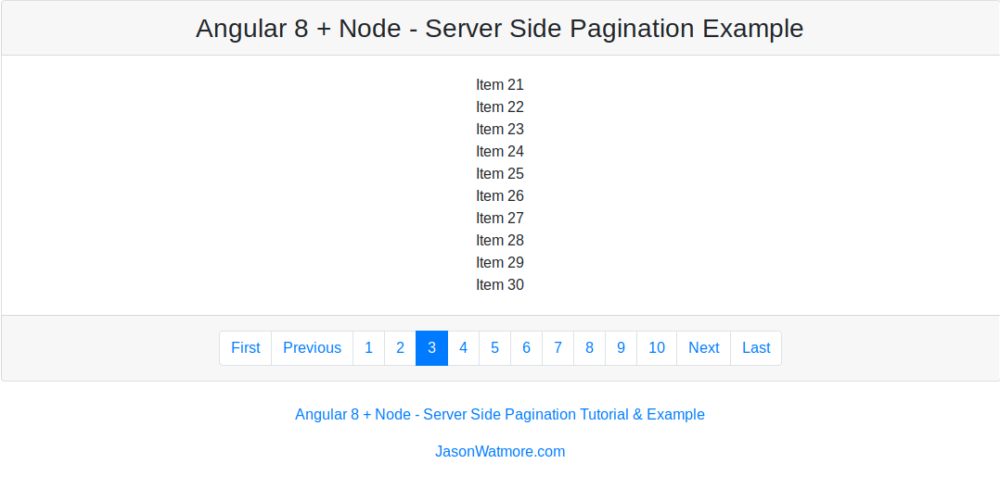

# angular-8-node-server-side-pagination

Angular 8 + Node - Server Side Pagination Example

For a demo and further details see https://jasonwatmore.com/post/2019/06/28/angular-8-node-server-side-pagination-tutorial-example
* Tenemos que crear un nuevo proyecto con:
   ```
   #ng new clientServer
   ```
Despues pasamos el archivo index.html  y la carpeta app  de client a cientServer.

Despues tenemos que agregar la ip del servidor api :
```
private loadPage(page) {
        // get page of items from api
        this.http.get<any>(`http://192.168.178.180:4000/api/items?page=${page}`).subscribe(x => {
            this.pager = x.pager;
            this.pageOfItems = x.pageOfItems;
        });
    }
```

